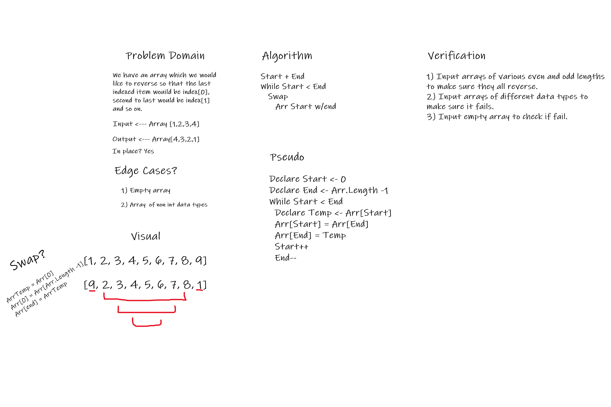

# Reverse an Array
Given an array, reverse all of the values in so that the first becomes the last and so forth.

## Whiteboard Process

## Approach & Efficiency
Big O is O(n) (linear) for this problem.

