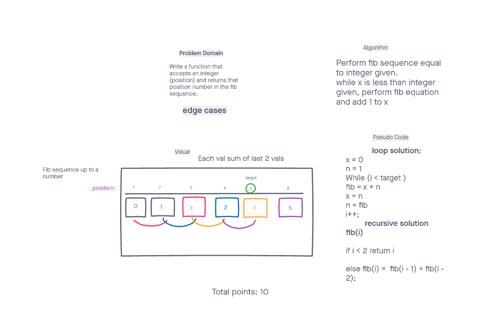

## Fibonnaci sequence
- Return the fibonnaci number of the given target position.

### Solved by Jona Brown with Ben Ibarra as interviewer

- Detailed problem domain with requirements of challenge.
- Made visual representation of how the fib sequence operates.
- Created algorithm.
- Outlined pseudo code in both recursive and non-recursive format. 

