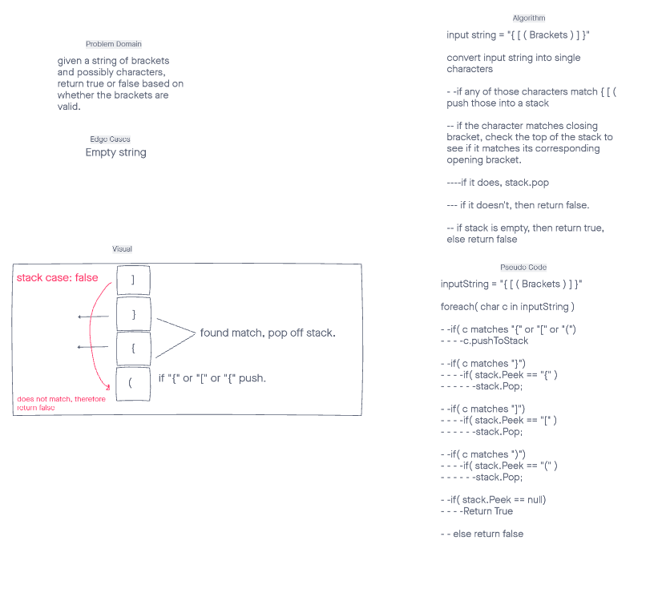

# Code Challenge 13 - Valid Brackets

## Summary -
Given a string of brackets (and possibly characters), return true or false based on whether the brackets are valid.

## Whiteboard Process

## Approach & Efficiency
 This solution (Check whiteboard) is O(n) or linear time. It traverses the string by each character and, in the worst case, returns a result at the very last character of the string.
