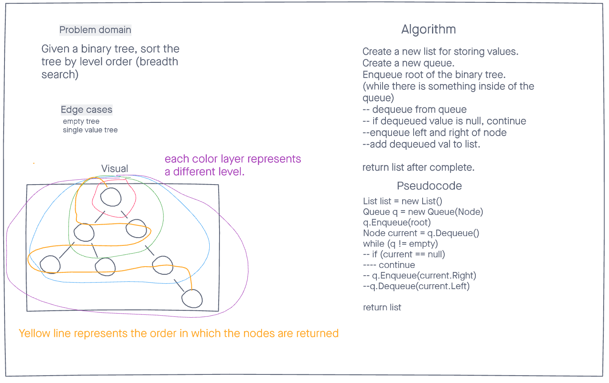

# Tree Level Order Traversal

## Challenge
Traverse a binary tree with level order (breadth first). This means going layer by layer into the tree.

## Approach & Efficiency
The Time and Space are both linear in this problem as for every iteration of a node, one thing is traversed.

## Whiteboard Process

## API
- This challenges uses:
Queue - to keep track of the current node that we want to add to the list.
Node - Contains left, right and value for traversing.

