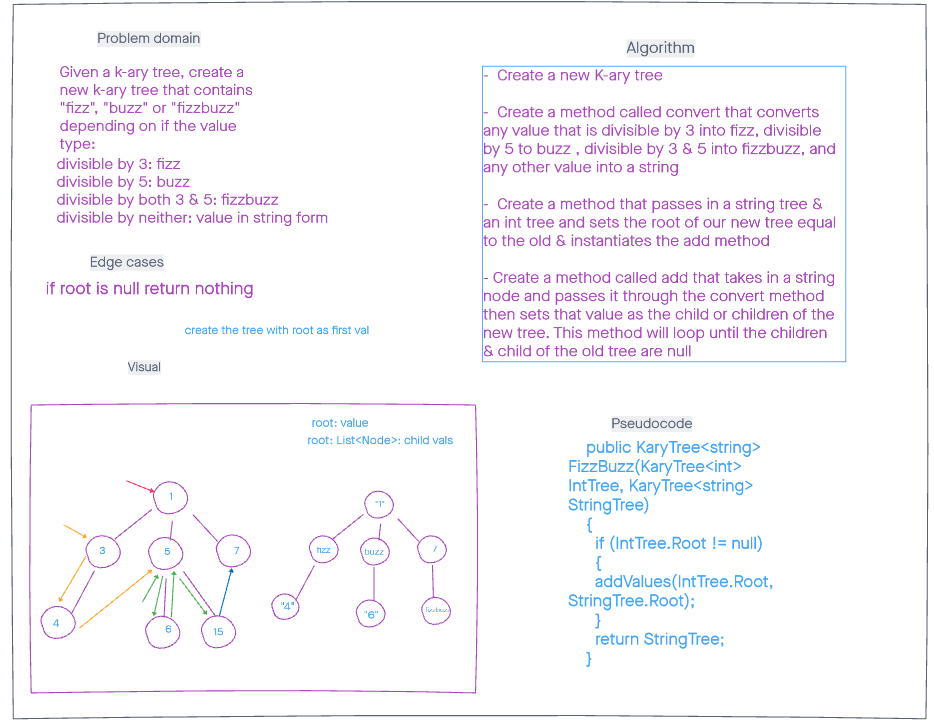

# K-Ary Tree FizzBuzz

## Challenge
Traverse a K-ary tree and convert the values into "fizz", "buzz" or "fizzbuzz" depending on
whether or not the value is divisible by 5, 3, or both 5 and 3. If none are divisible by these
numbers then return the number itself.

## Approach & Efficiency
The Time and Space are both linear in this problem as for every iteration of a node, one thing is traversed.
One extra tree is created as well.

## Whiteboard Process

## API
- This challenges uses these functions:
Convert: The logic to determine whether a node value is fizz, buzz, fizzbuzz or none.
AddValues: The recursive function that traverses the tree as well as adding the type of variable to the new string
tree.

