# Insertion Sort - A step by step guide by Jona Brown and Chaz Bofferding

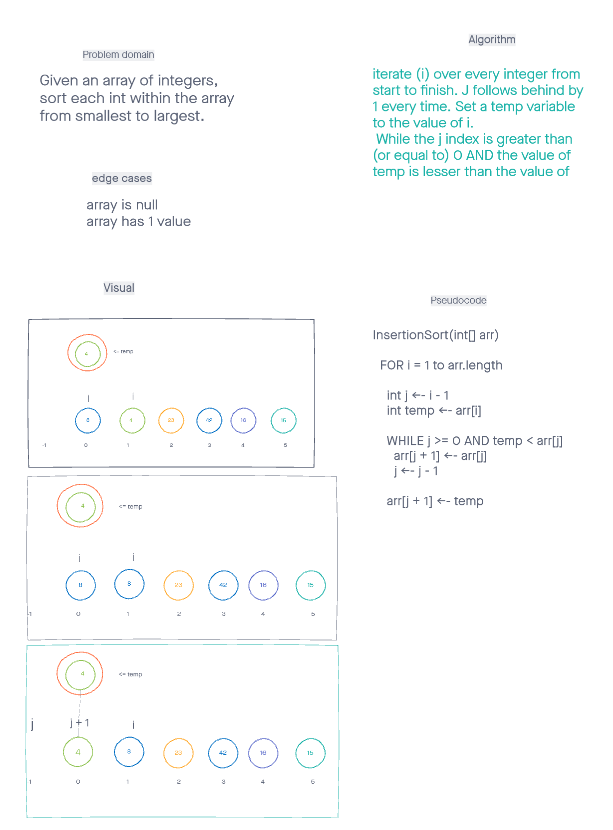

## Problem Domain: Given an array of integers, sort each int within the array from smallest to largest.
Here is our pseudo code -
``` cs
InsertionSort(int[] arr)

    // For every variable in 
    For i = 1 to arr.length{ 
        //setting j to 1 behind i.
        int j = i - 1

        int temp = arr[i]

        // While our backwards counting j is not negative in the index and the temp variable is lesser than 
        // the current value of j, keep moving the values forward in the line.
        while j >= 0 and temp < arr[j]
        {
            arr[j + 1] = arr[j]
            j--
        }
        // Finally, set the value of temp to the value of j + 1 and repeat the loop.
    }

``` 
Follow along with the images from top to bottom to understand how the code operates.

## Implementation:
The top number above the array signals the index numbers.  
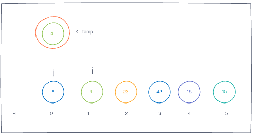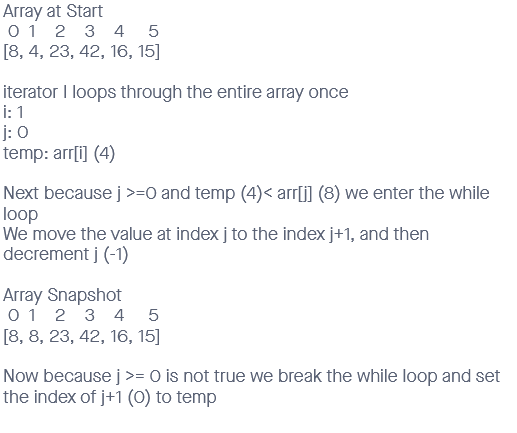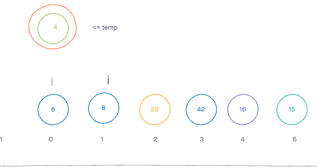 
## =============================
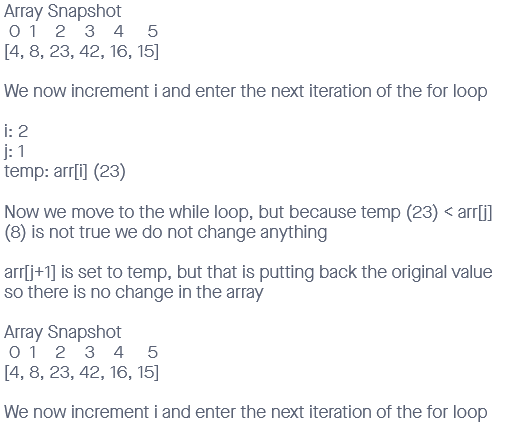 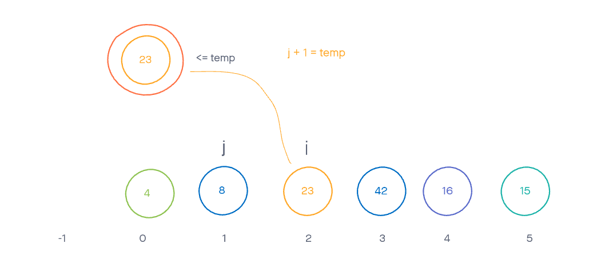
## =============================
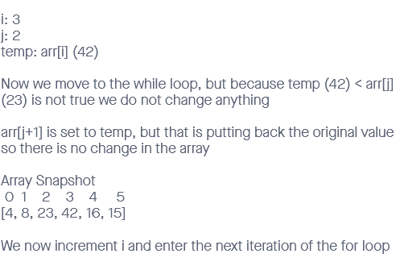 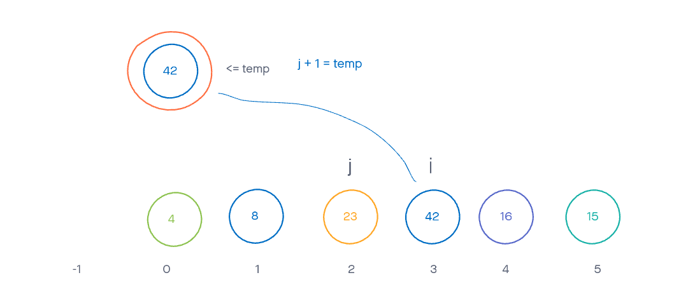
## =============================
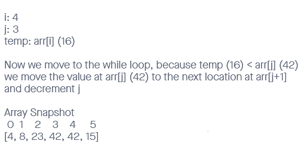 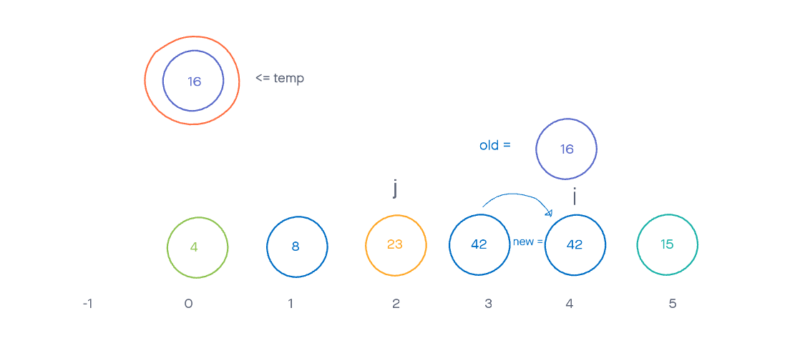
## =============================
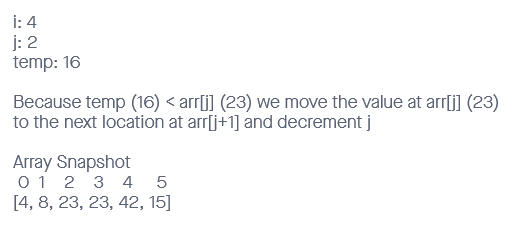 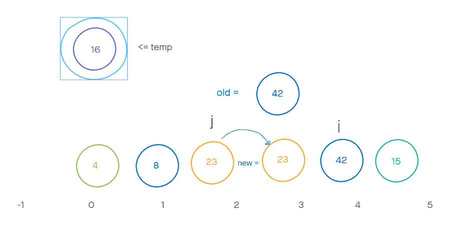
## =============================
 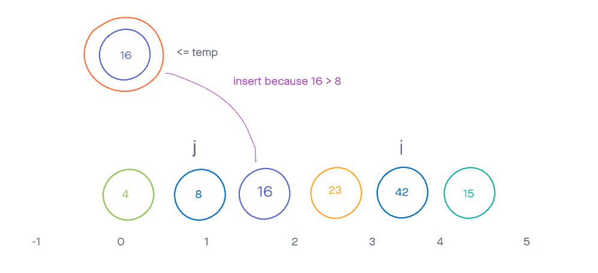
## =============================
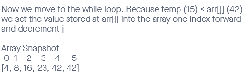 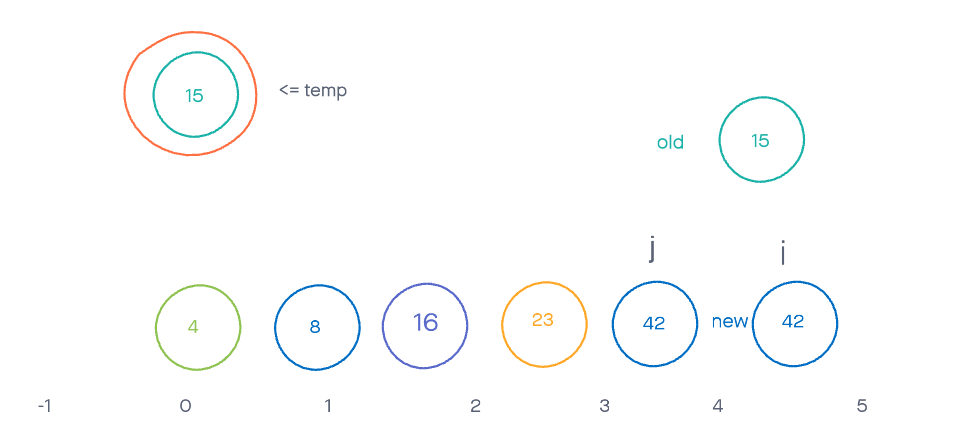
## =============================
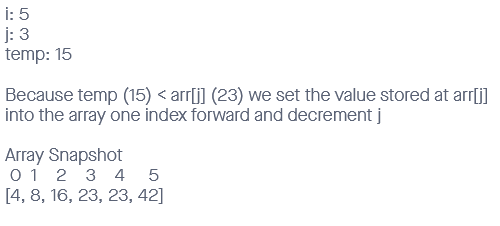 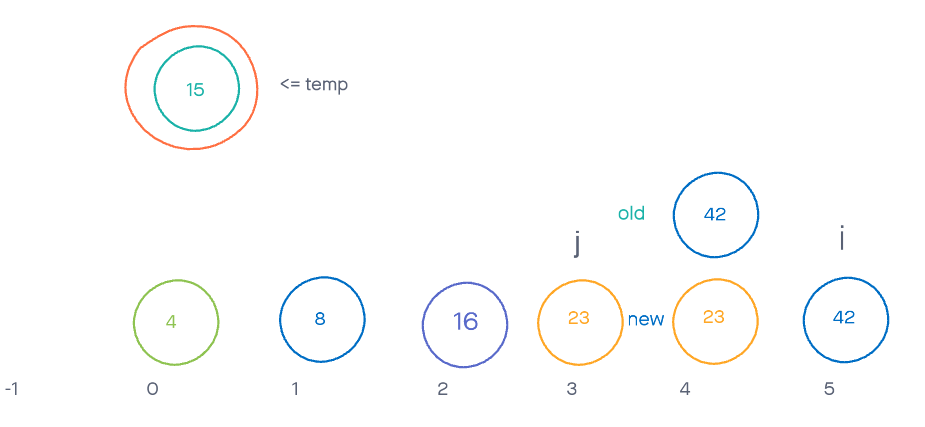
## =============================
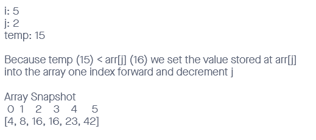 
## =============================
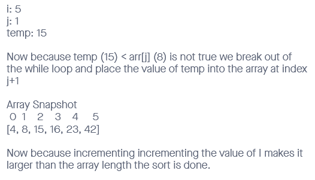 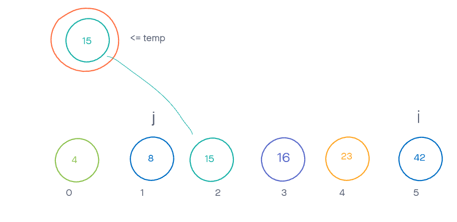
