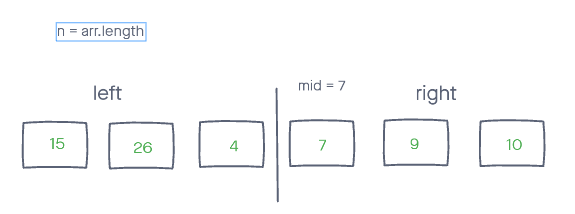
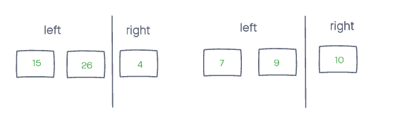
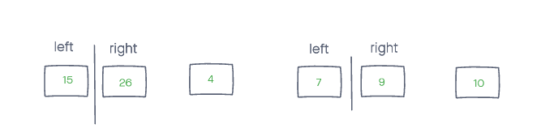
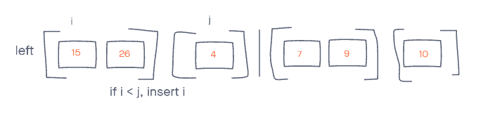
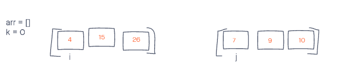

## Merge Sort algorithm - by Jona Brown, Joel Connell and Ben Arno

### Problem Domain
Given an unsorted array of integers, perform merge sort and return the sorted array.

### Starting array:
``` js
arr = [15, 26, 4, 7, 9, 10]
```

==================================================================  
Our first order of business is to split the array into two parts. We handle this by dividing the array length by 2, setting variable mid to that value and setting array left from index[0] to index[mid]. <br>
The "if" statement can be ignored for this moment, as well as the Merge function - this will be explained later.
``` cs
int[] Mergsort(arr)
{
    if n > 1
    {
        int n = arr.length;

        int mid = n / 2;
        // Left array created from the first half
        int[] left = arr[0 - mid]; 
        // Right array created from second half.
        int[] right = arr[mid  - n];

        Merge(left, right, arr);
    }
}
```


==================================================================  
### We call our original method recursively, starting with the left. This will also occur with the right, however left is the one to focus on for the moment as we are one level deep within recursion. 
``` cs
Mergesort(left)
Mergesort(right)
```

==================================================================  
### Our leftmost array is called upon once again through merge sort function. The same thing will be happening on the right side, but we continue with the left first.

==================================================================  
### We continue with this process on the leftmost array until we boil down to the left array's individual elements (15 and 26). Since we reach our condition of n (array length) being equal to 1 and not lesser than 1, we do not continue recursion down the left side.  
Image below shows all of the individual elements when our recursion is complete. Now the merge method begins.

==================================================================  
### Once both left and right recursion is complete, the next method (Merge) is called on both those left and right arrays (starting with the arrays that have only length of 1). The array that is being passed in with this instance is our original array that we are modifying.
``` cs
void Merge(left, right, arr)
{
    int i = 0; // iterating over the left array
    int j = 0; // for iterating over the right array 
    int k = 0; // for overwriting into our original array

    while (i < left.length && j < right.length)
    {
        // If left array at index j is lesser, then insert first. If not, then insert right array at i. push the index forward for the value that was inserted.
        if (left[i] <= right[j])
        {
            arr[k] = left[i];
            i++;
        }
        else 
        {
            arr[k] = right[j];
            j++;
        }
        // go to the next array index in the array that we are modifying.
        k++;
    }
}
```

==================================================================  
### The process above is repeated each time our Merge function is called, and the left/right values keep growing until we are left with the entire sorted array.


==================================================================  