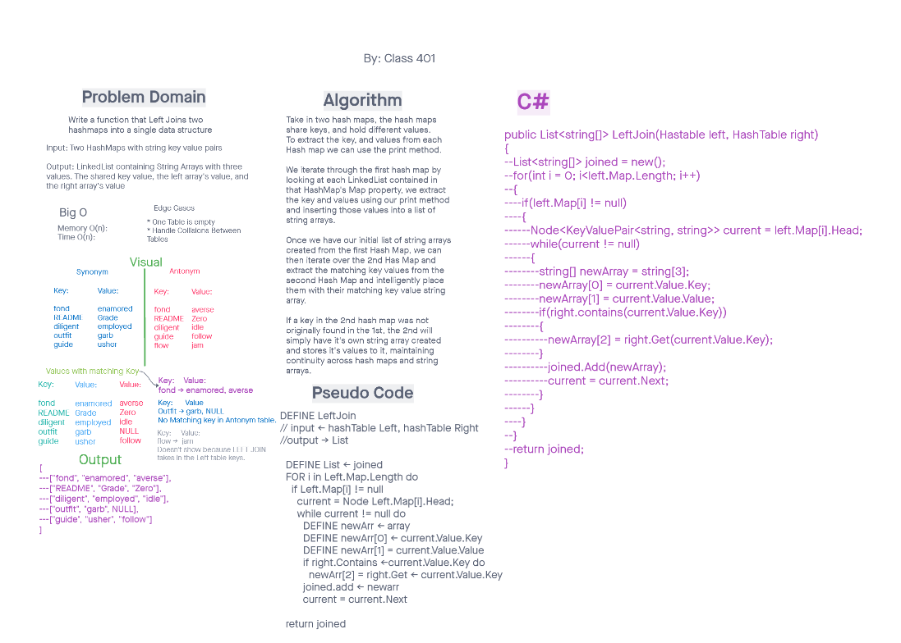

# Hashmap LEFT JOIN

## Challenge

Given two separate hashtables, merge the right's values to the left array if the right
and left key match. If the key exists in the left value but not the right, the new array will produce null.

## Approach & Efficiency
Memory and time analysis are both O(n) linear time, as we perform one loop through the first hashtable and get all of our results from that.
## Solution
1. Iterate through the first hash table.
2. If the second table contains the first key, add it to an array with the key and value of the first hash table.
3. continue until complete. 

