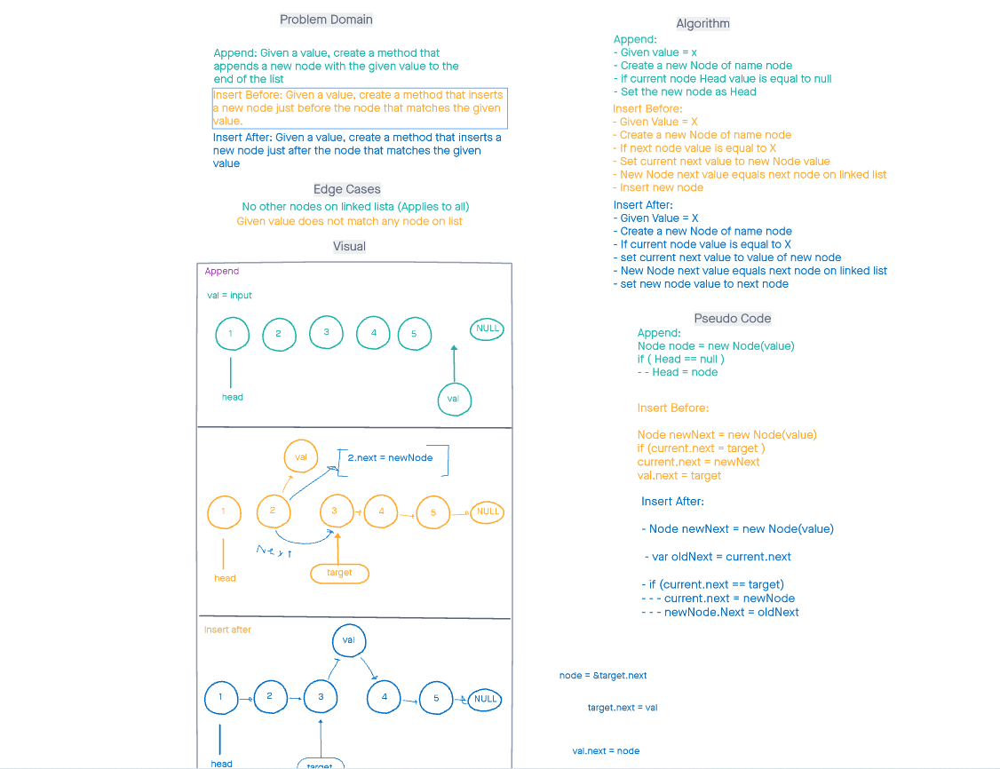

# Data Structures README - 

## Summary -
This project is an addition to the previously created linked list functions insert, print and includes. The additions are:

- InsertBefore: Prior to the target value, insert a node and have it link to with the others.

- InsertAfter: After the target value, insert a node and have it link with the others.

- Append: Add a Node value to the very end of the list (just before the tail).

## Whiteboard -

