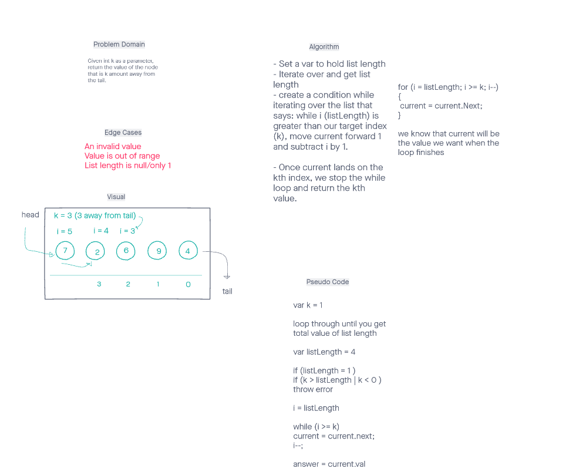

# Challenge Summary
- Given an integer for input, find the value of the node that is the input's value's index away from TAIL of the linked list.

## Whiteboard Process

## Approach & Efficiency
This problem has a (O(n) x 2) as it must iterate through the array twice - one time for obtaining the entire length of the array and once more (worst case) to find where the kth value is.
O(1) space as we create 1 variable, (length).

## Solution

The solution involves forwardly iterating over a singly linked list and subtracting our counter until it reaches our desired k value.

