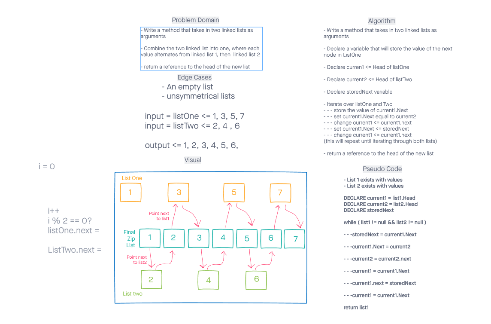

# Linked List Zip

## Summary -
Given two separate linked lists, combine them into one by alternating after each insertion. Print the result Afterwards.

## Whiteboard Process -

## Approach & efficieny -
Iterating through a while loop seemed to be the most elegant approach (although more verbose).
In order to keep O(1) Memory, adding the second linked list into the first was the most suitable approach.

## Solution -

1. to create placebolder Node variable that will store the next value of the first linked list.
2. The .Next value of linked list 1 will be moved to the head of linked list 2.
3. Move both linked list 1 and linked list 2 over to the next value (linked list 1 is now on the newest variable added from linked list 2).
4. Finally, move linked list 1 over to the very next variable and start the process over again until linked list 1 and 2 are null.

- If ll1 ends before ll2 does, we add every ll2 value afterward to ll1 without worrying about alternating.
- If ll2 ends before ll1 does, we do nothing as ll1 is where we are storing the answer.
